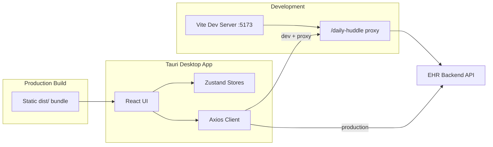

# Daily Team Huddle

A lightweight **Tauri desktop application** for clinic teams to review patient quality measures (HEDIS) and medication adherence data during daily huddles. Built for speed, a small install footprint, and a focused workflow: authenticate, filter, review, export, and email today's visit list.

---

## Table of Contents

- [Overview](#overview)
- [Features](#features)
- [Tech Stack](#tech-stack)
- [Architecture](#architecture)
- [Project Structure](#project-structure)
- [Prerequisites](#prerequisites)
- [Getting Started](#getting-started)
- [Development Modes](#development-modes)
- [Environment Configuration](#environment-configuration)
- [Authentication](#authentication)
- [API Reference](#api-reference)
- [Dashboard Workflow](#dashboard-workflow)
- [Mock Mode](#mock-mode)
- [Build & Distribution](#build--distribution)
- [Scripts Reference](#scripts-reference)
- [Troubleshooting](#troubleshooting)

---

## Overview

Daily Team Huddle connects to a backend EHR API and presents a unified patient table that merges **HEDIS** (Healthcare Effectiveness Data and Information Set) and **Med Adh** (medication adherence) records. Clinic staff use a single access code to sign in, apply filters (insurance, quality program, PCP, measures, appointment window), search and sort results, inspect row details, export to Excel, and send a formatted daily visit email — all from a native Windows desktop window.

The app was migrated from Electron to **Tauri 2**, reducing the installer from ~85 MB to ~2 MB while keeping the same React frontend.

---

## Features

| Area | Capabilities |
|------|-------------|
| **Authentication** | Clinic access code login; session persisted in `localStorage` with a 2-hour expiry |
| **Patient table** | Sortable, paginated TanStack Table with HEDIS and Med Adh columns |
| **Filtering** | Insurance, quality program, PCP, measures (multi-select), appointment range (today / 7 / 15 / 30 days / custom), source type (HEDIS / Med Adh / all) |
| **Search** | Client-side search across patient name, measure, insurance, PCP, and related fields |
| **Status colors** | Server-driven color mapping for measure, patient, eligibility, and report statuses |
| **Row details** | Modal with full HEDIS or Med Adh detail fields per patient |
| **Export** | Download filtered table data as `.xlsx` (SheetJS) |
| **Daily email** | Preview and send today's visit summary via backend SMTP (`POST /daily-huddle/daily-email`) |
| **Theme** | Light / dark mode toggle, persisted locally |
| **Desktop shell** | Custom frameless title bar, window controls, single-instance guard, system tray |
| **Resilience** | Automatic retry on API calls; session invalidation on 401; friendly network error messages |

---

## Tech Stack

| Layer | Technology |
|-------|------------|
| Desktop shell | [Tauri 2](https://tauri.app/) (WebView2 on Windows) |
| UI | React 19, TypeScript |
| Build | Vite 8 |
| Routing | React Router 7 (HashRouter) |
| State | Zustand |
| HTTP | Axios |
| Table | TanStack Table 8 |
| Animation | Framer Motion |
| Icons | Lucide React |
| Export | SheetJS (`xlsx`) |
| Backend | Rust 1.89 (Tauri native layer) |

---

## Architecture



**Request routing**

- **Development** (`npm run dev`, `npm run dev:web`): Axios uses an empty base URL; requests go to `/daily-huddle/*` on the Vite server, which proxies to `VITE_API_PROXY_TARGET`.
- **Production** (`npm run build`, `npm run dist`): Axios calls `VITE_API_BASE_URL` directly. Values are baked in at build time — rebuild after changing `.env`.

**Auth header:** Every authenticated request sends `Authorization: <token>` (raw token value, no `Bearer` prefix).

---

## Project Structure

```
daily-huddle/
├── src/
│   ├── api/              # Axios clients: auth, patients, filters, email, status colors
│   ├── components/
│   │   ├── auth/         # Login card, animated background
│   │   ├── dashboard/    # DataTable, FilterModal, toolbars, modals
│   │   ├── layout/       # Header, TitleBar, window controls
│   │   └── ui/           # Shared UI primitives (Modal, Toast, ThemeToggle, …)
│   ├── hooks/            # useAuthCheck, useDesktopRestrictions
│   ├── lib/              # Session, filters, export, email templates, formatting
│   ├── pages/            # AuthPage, DashboardPage
│   ├── routes/           # ProtectedRoute, PublicRoute
│   ├── stores/           # authStore, alertStore, statusColorStore, themeStore
│   └── types/            # Patient, filter, auth, status color types
├── src-tauri/
│   ├── src/
│   │   ├── chrome/       # Profile, password, cookie, and stored-data commands
│   │   ├── window/       # Shell, launch mode, single-instance, show signal
│   │   ├── screen/       # Screen sender, clipboard, remote files, address swap
│   │   ├── platform/     # Windows DPAPI helpers
│   │   ├── lib.rs        # Tauri setup, tray, and command registration
│   │   └── main.rs       # Process entry, including the elevated key helper
│   ├── capabilities/     # Tauri 2 permission capabilities
│   ├── tauri.conf.json   # App metadata, window config, bundle targets
│   └── rust-toolchain.toml
├── scripts/
│   ├── tauri.mjs         # Tauri CLI wrapper
│   ├── prepare-dist.mjs  # Kills running app before build (Windows)
│   └── copy-dist.mjs     # Copies installers to release-build/
├── .env.example          # Environment template
├── .env.development      # Enables Vite API proxy in dev
├── vite.config.ts
└── release-build/        # Output: .exe and .msi installers (after npm run dist)
```

---

## Prerequisites

| Requirement | Notes |
|-------------|-------|
| **Node.js 20+** | For frontend tooling and scripts |
| **Rust 1.89** | Installed via [rustup](https://rustup.rs/); pinned in `src-tauri/rust-toolchain.toml` |
| **Windows 10/11** | Primary target platform; WebView2 runtime (pre-installed on most systems) |
| **Backend API** | EHR server exposing `/daily-huddle/*` endpoints (or use mock mode) |

---

## Getting Started

### 1. Clone and install

```bash
npm install
```

### 2. Configure environment

```bash
cp .env.example .env
```

Edit `.env` and set your backend URLs (see [Environment Configuration](#environment-configuration)).

### 3. Run the app

**Desktop (recommended):**

```bash
npm run dev
```

Starts the Vite dev server and opens the Tauri window automatically.

**Browser-only:**

```bash
npm run dev:web
```

Open [http://127.0.0.1:5173](http://127.0.0.1:5173). API calls are proxied through Vite.

---

## Development Modes

| Command | What runs | API routing |
|---------|-----------|-------------|
| `npm run dev` | Vite + Tauri window | Proxy → `VITE_API_PROXY_TARGET` |
| `npm run dev:web` | Vite only (browser) | Proxy → `VITE_API_PROXY_TARGET` |
| `npm run build` | TypeScript check + Vite production build | N/A (static assets) |
| `npm run dist` | Full Tauri bundle + copy installers | Uses `VITE_API_BASE_URL` from `.env` |

### Why browser login can fail (but desktop works)

In the browser, the app runs on `http://127.0.0.1:5173` while the API lives on another host — a cross-origin request unless proxied.

**Fix:** Ensure `.env.development` sets `VITE_API_USE_PROXY=true` (included by default) and `VITE_API_PROXY_TARGET` in `.env` points at your running backend.

---

## Environment Configuration

Copy `.env.example` to `.env` and configure:

| Variable | Required | Description |
|----------|----------|-------------|
| `VITE_API_BASE_URL` | Production | Backend API base URL, no trailing slash. Example: `https://ehr.example.com`. Used in packaged builds. |
| `VITE_API_PROXY_TARGET` | Development | Backend URL for the Vite dev proxy. Usually the same host as `VITE_API_BASE_URL`. |
| `VITE_USE_MOCK` | Optional | Set to `true` to use in-memory mock auth and patient data (no backend needed). |

**`.env.development`** (committed, dev-only):

```env
VITE_API_USE_PROXY=true
```

When `VITE_API_USE_PROXY=true`, Axios sends requests to `/daily-huddle/*` on the Vite server, which forwards them to `VITE_API_PROXY_TARGET`.

**Important:** Production values are embedded at build time. After changing `.env`, run `npm run build` or `npm run dist` again.

Daily visit emails are sent through the backend (`POST /daily-huddle/daily-email`). Configure SMTP credentials on the server, not in the frontend.

---

## Authentication

### Flow

1. User enters a **clinic access code** on the auth screen.
2. App calls `POST /daily-huddle/auth` with `{ code }`.
3. On success, the server returns `{ status: "success", clinic, token, message }`.
4. Token and clinic are saved to `localStorage` with a **2-hour session expiry**.
5. User is redirected to `/dashboard`.
6. All subsequent API calls include `Authorization: <token>`.
7. On 401 or expiry, the session is cleared and the user is sent back to `/auth`.

### Session storage keys

| Key | Purpose |
|-----|---------|
| `dh_token` | Auth token from `/daily-huddle/auth` |
| `dh_huddle_token` | Token returned with patient data (used for daily email) |
| `dh_clinic` | Clinic object (JSON) |
| `dh_session_expires_at` | Unix timestamp for 2-hour expiry |

Filter preferences are stored separately in `localStorage` per clinic ID.

---

## API Reference

All endpoints are relative to the API base URL. Paths begin with `/daily-huddle/`.

### Authentication

#### `POST /daily-huddle/auth`

Authenticate with a clinic access code.

**Request:**

```json
{ "code": "your-access-code" }
```

**Success response:**

```json
{
  "status": "success",
  "clinic": { "id": "123", "name": "Example Clinic" },
  "token": "session-token",
  "message": "Success!"
}
```

**Error response:**

```json
{
  "status": "error",
  "clinic": null,
  "token": null,
  "message": "Clinic not found"
}
```

---

### Patient data

#### `POST /daily-huddle/`

Fetch merged HEDIS + Med Adh patient rows.

**Request:**

```json
{
  "clinic_id": "123",
  "ins_id": "INS-AET",
  "qp_id": "QP-01",
  "pcp_id": "0",
  "cyear": 2026,
  "filter": "",
  "measures": "1,2,3",
  "appt_start": "2026-07-05",
  "appt_end": "2026-07-05"
}
```

| Field | Description |
|-------|-------------|
| `clinic_id` | Clinic identifier from auth |
| `ins_id` | Insurance ID (`"0"` = all) |
| `qp_id` | Quality program ID (`"0"` = all) |
| `pcp_id` | PCP ID (`"0"` = all PCPs) |
| `cyear` | Calendar year for measures |
| `filter` | Additional server-side filter string |
| `measures` | Comma-separated measure IDs |
| `appt_start` / `appt_end` | Appointment date range (`YYYY-MM-DD`) |

**Success response:**

```json
{
  "status": "success",
  "token": "huddle-token",
  "data": [
    {
      "source": "hedis",
      "ins_name": "Aetna",
      "measure": "HbA1c Control",
      "pt_fname": "Jane",
      "pt_lname": "Doe",
      "details": { "v_status": "Open", "appt_date": "2026-07-05", "..." : "..." }
    }
  ]
}
```

Each row has `source` of `"hedis"` or `"med_adh"` with a type-specific `details` object.

---

### Filter lookups

All filter endpoints use `POST` with `{ clinic_id }` unless noted.

| Endpoint | Extra params | Returns |
|----------|--------------|---------|
| `/daily-huddle/insurance` | — | `{ ins_id, ins_name }[]` |
| `/daily-huddle/quality-program` | `ins_id` | `{ qp_id, qp_name }[]` |
| `/daily-huddle/pcp` | — | `{ pcp_id, pcp_name }[]` |
| `/daily-huddle/measures` | — | `{ measure_id, measure }[]` |

---

### Status colors

#### `GET /daily-huddle/status-color`

Returns color definitions for measure, patient, eligibility, and report statuses.

**Success response:**

```json
{
  "status": "success",
  "data": [
    {
      "id": 1,
      "status_type": "measure",
      "measure_status_display": "Open",
      "status_category_display": "Open",
      "status_description": "Measure is open.",
      "text_color": "#1d4ed8",
      "bg_color": "#dbeafe"
    }
  ]
}
```

---

### Daily email

#### `POST /daily-huddle/tokenization`

Fetch clinic tokenization count for email footer.

**Request:** `{ "clinic_id": "123" }`

**Response:** `{ "status": "success", "tokenization": 42 }`

#### `POST /daily-huddle/daily-email`

Send the daily visit summary email. The frontend builds HTML/text/subject from today's filtered patients.

**Request:**

```json
{
  "clinic_id": "123",
  "ins_id": "INS-AET",
  "qp_id": "QP-01",
  "token": "42",
  "subject": "Daily Visit Report — ...",
  "html": "<html>...</html>",
  "text": "Plain text version",
  "report_date": "2026-07-05"
}
```

---

## Dashboard Workflow

1. **Load filters** — Insurance, quality program, PCP, and measure lists are fetched for the authenticated clinic.
2. **Apply filters** — Saved filter preferences are restored from `localStorage` per clinic.
3. **Fetch patients** — `POST /daily-huddle/` with selected filter parameters.
4. **Review** — Sort columns, paginate, search, and open row detail modals.
5. **Status colors** — Cells are styled using server-provided color mappings.
6. **Export** — Download the currently displayed (filtered + searched) rows as Excel.
7. **Daily email** — Preview today's appointments (insurance + quality program scoped), then send via backend.

### Filter defaults

| Filter | Default |
|--------|---------|
| Insurance | All Insurances |
| Quality program | All Quality Program |
| PCP | All PCPs |
| Measures | All (none selected) |
| Appointment | Today |
| Source | All (HEDIS + Med Adh) |

---

## Mock Mode

Set `VITE_USE_MOCK=true` in `.env` to run without a backend.

| Item | Value |
|------|-------|
| Access code | `roswell123` |
| Clinic | Roswell Primary Care (`CLN-101`) |
| Data | Sample HEDIS and Med Adh patients, insurance/PCP/measure lists, status colors |

The auth screen shows a hint with the demo code when mock mode is active.

---

## Build & Distribution

### Build frontend only

```bash
npm run build
```

Output: `dist/`

### Package installers

```bash
npm run dist
```

This runs `prepare-dist.mjs` (stops a running app on Windows), builds the Tauri bundle, and copies installers to `release-build/`:

```
release-build/
├── Daily Team Huddle Setup 0.1.0.exe   # NSIS installer (~2 MB)
└── Daily Team Huddle 0.1.0.msi         # MSI installer
```

### Installer size comparison

| | Electron (before) | Tauri (now) |
|---|-------------------|-------------|
| Installer (`.exe`) | ~85 MB | **~2 MB** |
| App binary (unpacked) | ~299 MB | **~8 MB** |

### Rust build artifacts

To avoid Windows file-lock issues during rebuilds, Cargo output is redirected to:

```
%USERPROFILE%\.cargo\daily-huddle-target\
```

See `src-tauri/.cargo/config.toml`.

### Code signing

The Tauri bundle config includes a Windows signtool command for release signing. Update the path in `src-tauri/tauri.conf.json` if your Windows SDK version differs.

---

## Scripts Reference

| Command | Description |
|---------|-------------|
| `npm run dev` | Vite dev server + Tauri desktop window |
| `npm run dev:web` | Browser-only Vite dev server on port 5173 |
| `npm run build` | TypeScript compile + Vite production build → `dist/` |
| `npm run preview` | Preview production build locally |
| `npm run lint` | ESLint across the project |
| `npm run dist` | Full release build + copy installers to `release-build/` |
| `npm run tauri` | Direct access to Tauri CLI via `scripts/tauri.mjs` |

---

## Troubleshooting

### "Unable to reach the API server" in development

1. Confirm your backend is running.
2. Check `VITE_API_PROXY_TARGET` in `.env` matches the backend URL.
3. Ensure `.env.development` has `VITE_API_USE_PROXY=true`.
4. Restart `npm run dev` after changing `.env`.

### "Unable to connect to the API server" in packaged app

1. Verify `VITE_API_BASE_URL` in `.env` is correct.
2. Rebuild: `npm run dist` (env vars are baked in at build time).
3. Check network/VPN connectivity to the backend host.

### Session expires unexpectedly

Sessions last **2 hours** (`SESSION_DURATION_MS` in `src/lib/session.ts`). A 401 from any API call also clears the session and redirects to login.

### Tauri build fails on Windows

- Ensure Rust 1.89 is installed: `rustup show`
- Close any running instance of Daily Team Huddle before rebuilding (`prepare-dist.mjs` handles this automatically).
- If file locks persist, delete `%USERPROFILE%\.cargo\daily-huddle-target\` and retry.

### Port 5173 already in use

Vite uses `strictPort: true`. Stop the other process or change the port in `vite.config.ts`.

---

## License

Private — internal use.
